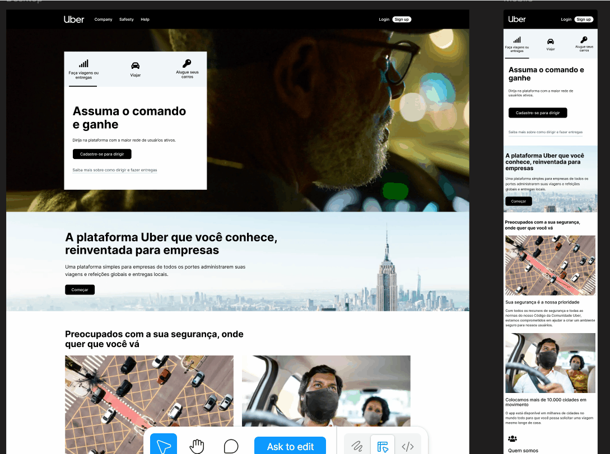

# 🚗 Uber UI Clone (Tailwind CSS)

Projeto desenvolvido com o objetivo de praticar e consolidar conhecimentos em **Tailwind CSS**, recriando a interface da página da Uber.

> ⚠️ Este projeto é apenas para fins de estudo (UI Clone), sem qualquer vínculo com a Uber.

---

## 📸 Preview

---

## 🚀 Tecnologias utilizadas

- HTML5
- Tailwind CSS
- Font Awesome

---

## 🎯 Objetivo

O foco principal deste projeto foi:

- Praticar **Tailwind CSS na prática**
- Trabalhar com **responsividade**
- Melhorar a organização de layout com **Flexbox e Grid**
- Simular uma interface real (Uber) para ganho de experiência

---

## 💻 Funcionalidades

- Header responsivo
- Hero section com call-to-action
- Seções institucionais
- Cards informativos
- Layout adaptável para diferentes telas
- Seção de download de app
- Footer completo

---

## 📱 Responsividade

O projeto foi desenvolvido com abordagem **mobile-first**, garantindo boa visualização em:

- 📱 Mobile
- 💻 Desktop

---

## Estrutura do projeto
📁 src
 ├── 📁 assets
 ├── index.html
📁 styles
 ├── style.css
 ├── output.css

 ---

 ## 📚 Aprendizados
 Durante o desenvolvimento, foram reforçados conceitos como:

-Utilização de classes utilitárias do Tailwind
-Organização visual com espaçamentos e tipografia
-Uso de hover, transition e scale
-Construção de layouts modernos sem CSS customizado

---

## 🛠️ Como rodar o projeto

-1. Clone o repositório:

git clone https://github.com/Guitrinda/uber-prototype

-2. Instale as dependências (se estiver usando Tailwind via CLI):
npm install

-3.Rode o Tailwind:
npx tailwindcss -i ./style/style.css -o ./style/output.css --watch

-4. Abra o arquivo index.html no navegador

---
